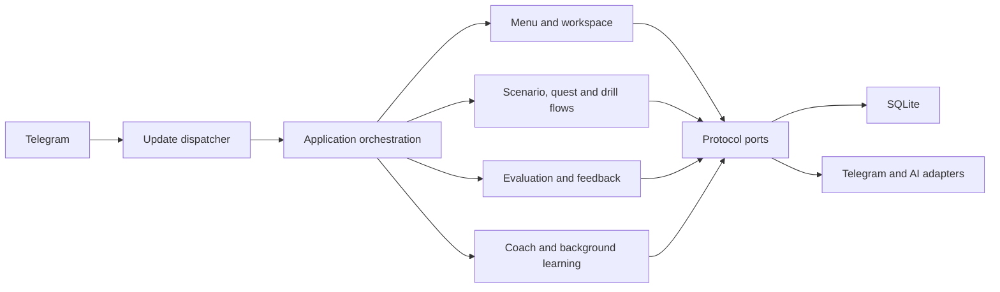

# Архитектура Tutorlaing

Актуально на 2026-08-07.

## Границы

Tutorlaing — модульный монолит: один Python-процесс, SQLite и Telegram
transport. Это намеренный выбор для alpha; прикладные области отделены узкими
`Protocol`-контрактами, а не микросервисами.

## Модули

| Модуль | Ответственность |
|---|---|
| `app.py` | composition root и orchestration переходов |
| `menu.py` / `navigation.py` | `Сегодня`, `Учиться`, `Помощник`, `Профиль`; локализованные переходы |
| `workspace.py` | одна актуальная Telegram-карточка и безопасный fallback при edit failure |
| `catalog.py` / `content.py` | курируемые ситуации и версии контента |
| `evaluation_service.py` / `feedback.py` | rule-based и AI-разбор ответа; видимый feedback |
| `activities.py` | проекция параллельных незавершённых занятий и их позиции |
| `coach.py` | side-channel преподавателя, не меняющий основной flow |
| `learning_cards.py` / `background_learning.py` | валидируемый semantic content и связанная микро-практика |
| `toolkit.py` | работа со своей фразой, переводные карточки и тематический drill |
| `reminders.py` | слоты, quiet hours, retry и доставка не более одного задания |
| `progress_service.py` / `learner_profile.py` | evidence-based прогресс и добровольный контекст |
| `storage.py` | SQLite schema, миграции, транзакции и owner-scoped данные |

## Контракты и инварианты

- Presentation не делает SQL и не рассчитывает учебный результат.
- AI не является единственным способом завершить flow: есть rule/content
  fallback.
- Только foreground activity принимает свободный ответ; остальные занятия
  сохраняются с позицией.
- Преподаватель и background card — side-channels: не меняют session id,
  current step или outcome основной работы.
- Reply keyboard содержит только постоянные намерения; inline callback всегда
  относится к видимой карточке и при необходимости содержит identity объекта.
- Один reminder slot материализует максимум одно задание.
- Новый учебный формат входит в `Учиться` или `Помощник`; новый верхний раздел
  требует usability-обоснования.
- Платёжные ограничения реализуются будущими `EntitlementPolicy` и
  `UsageMeter`; учебные flows не импортируют цены или billing SDK.

## Следующий технический долг

1. Зафиксировать transition table и вынести сценарий, review и drill в
   отдельные flow-классы без смены поведения.
2. Ввести типизированные DTO на границе SQLite вместо распространения
   `sqlite3.Row`.
3. Реализовать P1 reminder budget/cooldown как отдельный policy-модуль с
   контрактными тестами.
