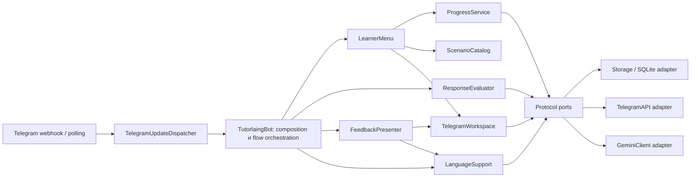

# Архитектура Tutorlaing

## Результат аудита

Проект остаётся модульным монолитом: один Python-процесс, одна SQLite-база и
один Telegram transport. Для текущей alpha это проще и надёжнее набора
микросервисов, но прикладные функции теперь разделены контрактами.

Исходное состояние перед рефакторингом:

- `app.py`: 2010 строк и 62 метода; transport routing, UI, AI, локализация,
  прогресс и учебный flow находились в одном `TutorlaingBot`;
- `storage.py`: 893 строки и 46 методов; SQL, миграции и транзакции доступны
  через один широкий concrete API;
- `reminders.py` импортировал одновременно `app.py` и `storage.py`, создавая
  обратную зависимость application → composition;
- Telegram `callback_data` и пользовательские состояния представлены строками,
  поэтому опечатки обнаруживаются только во время выполнения;
- `ai.py` содержит и модели результата, и порт провайдера, и Gemini adapter;
- границы модулей не проверялись автоматически.

После первого этапа:

- `app.py` уменьшен до 1361 строки; публичные wrapper-методы оставлены для
  совместимости существующих flows и тестов;
- UI workspace, меню, каталог курсов, языковая поддержка, прогресс,
  AI-feedback, оценка ответа и Telegram update dispatch вынесены отдельно;
- прикладные сервисы зависят от узких `Protocol`-портов из `contracts.py`;
- `reminders.py` зависит от `ReminderStore` и `ReminderDelivery`, а не от
  concrete `Storage` и `TutorlaingBot`;
- transport exceptions проходят через общий `TransportError`;
- architecture regression test запрещает application-модулям импортировать
  `app`, `storage` и `telegram_api`.

## Направление зависимостей

Правило: composition и adapters могут знать application-модули; application
не знает concrete adapters. `TutorlaingBot` является composition root и
координатором state machine, поэтому его concrete зависимости допустимы.

## Функциональные модули и контракты

| Модуль | Единственная ответственность | Входной контракт | Результат/эффект |
|---|---|---|---|
| `catalog.py` | Выбор курируемого курса по target language | `target_language` или профиль | Словарь `Scenario`; неизвестный язык — `ValueError` |
| `evaluation_service.py` | Rule-based оценка и необязательное AI-обогащение | `LanguageStore`, `AIClient`, scenario/step/response | `EvaluationResult`; при AI-сбое сохраняется rule-based результат |
| `language_support.py` | Перевод по запросу и level-aware сноски | `LanguageStore`, `AIClient` | Текст или безопасный fallback без перевода |
| `feedback.py` | Вкладки результата, natural variants и grammar drill-down | `FeedbackStore`, workspace, language support, `AIClient` | Одна редактируемая feedback-card |
| `progress_service.py` | Вывод mastery/focus/plan только из evidence | `ProgressStore` | Неизменяемый `ProgressSnapshot` |
| `menu.py` | Home/settings/progress/reminder/privacy presentation | `MenuStore` и специализированные сервисы | Telegram cards без изменения учебной state machine |
| `workspace.py` | Политика одной текущей карточки | `WorkspaceStore`, `TelegramGateway` | edit текущей либо один безопасный send |
| `update_dispatcher.py` | Dedupe и нормализация Telegram update | `UpdateStore`, `TelegramGateway`, `UpdateTarget` | Один вызов text/callback handler; failed update доступен для retry |
| `reminders.py` | Расчёт слотов и атомарная доставка | `ReminderStore`, `ReminderDelivery` | Не более одного assignment на зарезервированный slot |
| `app.py` | Composition root и orchestration учебной state machine | concrete adapters + application services | Переходы scenario/practice/review/drill |
| `storage.py` | SQLite schema, migrations и транзакционные операции | вызовы портов | Персистентное состояние и audit events |

Все порты находятся в `contracts.py`:

- `TelegramGateway` — send/edit/action/callback acknowledge;
- `WorkspaceStore` — профиль, workspace state и UI events;
- `LanguageStore` — профиль, AI-analysis persistence и events;
- `ProgressStore` — агрегированные учебные evidence;
- `FeedbackStore` — сохранённые AI analyses;
- `MenuStore` — профиль, reviews, reminder mode и progress evidence;
- `ReminderStore` / `ReminderDelivery` — планирование отдельно от materialization;
- `UpdateStore` / `UpdateTarget` — exactly-once local dispatch отдельно от bot;
- `TransportError` — единый recoverable transport failure.

Protocols являются структурными: `Storage` и `TelegramAPI` не наследуют их и
могут быть заменены test doubles или будущими adapters без изменения сервисов.

## Что намеренно не разделено сейчас

### SQLite repositories

`Storage` пока остаётся одним adapter. Разделение на десяток repository-классов
поверх одной connection создало бы больше ceremony и усложнило транзакции, не
дав независимого deployment или второго storage engine. Следующий оправданный
шаг — вынести schema migrations и типизированные DTO; repositories нужны при
появлении второго backend либо сложных междоменных транзакций.

### Учебная state machine

В `TutorlaingBot` остаются scenario, practice, review и drill orchestration и
строковый callback dispatcher. Это главный оставшийся hotspot. Его следует
делить вертикальными use cases (`ScenarioFlow`, `ReviewFlow`, `DrillFlow`) после
фиксации transition table и contract tests. Простое перемещение if/elif в новый
файл не уменьшает связанность.

### AI provider

`ai.py` пока объединяет DTO/schema, `AIClient` и Gemini adapter. Перед вторым
провайдером нужно выделить `ai_models.py`, provider port и adapters, а также
централизованные timeout/retry/cost policies. До второго провайдера это
контролируемый долг.

## Правила дальнейших изменений

1. Новый use case принимает только минимальный Protocol, а не весь `Storage`.
2. Presentation не выполняет SQL и не рассчитывает mastery/оценку.
3. AI никогда не является единственным способом завершить учебный flow.
4. Один Telegram update либо завершается, либо освобождается для retry.
5. Один scheduled slot материализует максимум одно задание.
6. Новый target language добавляется через `ScenarioCatalog` и изолируется в
   storage queries; UI не ветвится по языку в orchestration.
7. Любая новая граница получает unit test; критический пользовательский путь —
   integration test через `TutorlaingBot`.

## Следующий технический backlog

1. Описать state/callback transition table и выделить `ScenarioFlow`,
   `ReviewFlow`, `DrillFlow` без изменения поведения.
2. Заменить raw `sqlite3.Row` на типизированные profile/evidence DTO на границе
   application.
3. Вынести schema migrations из `Storage` и тестировать upgrade с каждой
   поддерживаемой предыдущей версии.
4. Типизировать callback actions и learner stages через enum/value objects.
5. Разделить AI models/port/Gemini adapter перед подключением второго provider.
6. Добавить formatter/linter/type-checker в CI после устранения исторических
   нарушений, без массового изменения продуктового кода одним коммитом.
