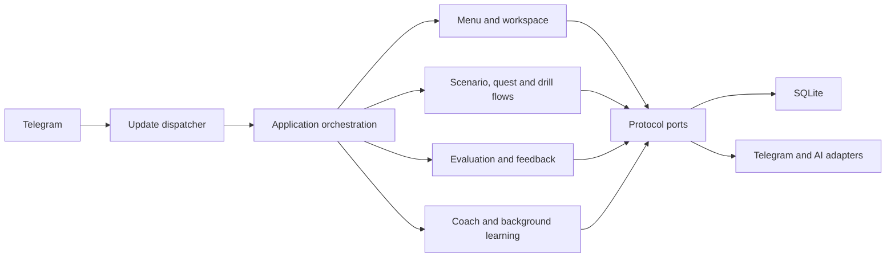

# Архитектура Tutorlaing

Актуально на 2026-10-06.

## Границы

Tutorlaing — модульный монолит: один Python-процесс, SQLite и Telegram
transport. Это намеренный выбор для alpha; прикладные области отделены узкими
`Protocol`-контрактами, а не микросервисами.

```mermaid
flowchart LR
    TG[Telegram] --> UD[Update dispatcher]
    UD --> APP[Application orchestration]
    APP --> UI[Menu and workspace]
    APP --> FLOW[Scenario, quest and drill flows]
    APP --> AI[Evaluation and feedback]
    APP --> SIDE[Coach and background learning]
    UI --> PORTS[Protocol ports]
    FLOW --> PORTS
    AI --> PORTS
    SIDE --> PORTS
    PORTS --> DB[SQLite]
    PORTS --> API[Telegram and AI adapters]
```

## Модули

| Модуль | Ответственность |
|---|---|
| `app.py` | composition root и orchestration переходов |
| `menu.py` / `navigation.py` | `Сегодня`, `Учиться`, `Помощник`, `Профиль`; локализованные переходы |
| `workspace.py` | одна актуальная Telegram-карточка и безопасный fallback при edit failure |
| `catalog.py` / `content.py` | курируемые ситуации и версии контента |
| `evaluation_service.py` / `feedback.py` | rule-based и AI-разбор ответа; видимый feedback |
| `activities.py` | проекция параллельных незавершённых занятий и их позиции |
| `coach.py` | side-channel преподавателя, не меняющий основной flow |
| `learning_cards.py` / `background_learning.py` | валидируемый semantic content и связанная микро-практика |
| `hourly_cards.py` | генерация и fallback batch-а почасовых карточек; состояние, scheduling и mastery остаются в storage/app |
| `vocabulary.py` | DTO словаря, `VocabularyAI`/`VocabularyStore`, текстовые пары, Unicode-ключи, очередь повторов и школьный тест |
| `vocabulary_flow.py` | photo import, проверка/правка списка, локализованный Telegram flow без изменения основной session |
| `game_service.py` | реестр правил игр, приглашения по @username/ссылке, очередность ходов и owner-scoped проекция состояния |
| `games_web.py` / `games/` | проверка Telegram Mini App `initData`, JSON API и статический мобильный игровой стол |
| `toolkit.py` | работа со своей фразой, переводные карточки и тематический drill |
| `reminders.py` | слоты, quiet hours, retry и доставка не более одного задания |
| `progress_service.py` / `learner_profile.py` | evidence-based прогресс и добровольный контекст |
| `storage.py` | SQLite schema, миграции, транзакции и owner-scoped данные |

## Контракты и инварианты

- Presentation не делает SQL и не рассчитывает учебный результат.
- AI не является единственным способом завершить flow: есть rule/content
  fallback.
- Только foreground activity принимает свободный ответ; остальные занятия
  сохраняются с позицией.
- Преподаватель и background card — side-channels: не меняют session id,
  current step или outcome основной работы.
- Reply keyboard содержит только постоянные намерения; inline callback всегда
  относится к видимой карточке и при необходимости содержит identity объекта.
- Один reminder slot материализует максимум одно задание.
- Новый учебный формат входит в `Учиться` или `Помощник`; новый верхний раздел
  требует usability-обоснования.
- Платёжные ограничения реализуются будущими `EntitlementPolicy` и
  `UsageMeter`; учебные flows не импортируют цены или billing SDK.
- Mini App не доверяет `initDataUnsafe`: backend проверяет HMAC `initData`,
  срок сессии и alpha-access до любой операции с игрой.
- Игра не использует учебный foreground: участник, версия игры и текущий ход
  проверяются SQLite-транзакцией перед записью.
- Telegram `chat_id` — единственный identity; обновляемый `@username` служит
  лишь для поиска, а ссылочное приглашение — одноразовый bearer-token с TTL.
- Игры с закрытой информацией обязаны возвращать через `GameDefinition` только
  player-scoped проекцию состояния: колода и рука соперника не выходят из backend.
  Для «Морского боя» эта же граница скрывает расклад флота соперника.

## Контракт словаря с текстом и фото

`TelegramGateway.download_image(file_id, max_bytes) -> bytes` разрешает путь
через `getFile`, ограничивает чтение 10 МБ, хранит фото только в памяти и
возвращает безопасную ошибку без token-bearing URL. Dispatcher передаёт
`handle_photo` для Telegram photo и JPEG/PNG/WebP document; caption не команда.
Consent и alpha-access проверяются до скачивания.

`VocabularyAI.extract_vocabulary(image, mime_type, source_language,
instruction_language, heartbeat=None) -> VocabularyList` возвращает весь список `VocabularyWord`:
source, source_language (`pl`/`ru`), english, accepted_answers, hint,
explanation, example_gap. Общая JSON schema обслуживается обоими провайдерами;
OpenAI использует Responses image input и `store=false`, Gemini — inlineData.
OCR сначала транскрибирует записи страницами по 50 (`cursor`, `has_more`,
`total_entries`), затем готовит учебный материал пачками по 20. Повтор страницы,
непродвигающийся cursor и неполный итог вызывают ошибку, а не сохранение обрезанного
набора. AI возвращает материал однократно; повторное прохождение использует БД.

`VocabularyAI.prepare_text_vocabulary(text, source_language, instruction_language, heartbeat=None)`
возвращает тот же `VocabularyList`. Общего лимита числа записей/символов нет;
`text_entries` принимает строки/элементы через запятую или `;`, до 220 символов
на запись, многословная фраза остаётся одним элементом. Адаптер проверяет число
записей каждой пачки. Дедупликация сохраняет разные переводы одного источника.
Явные пары через `=`
обрабатываются локально, включая `English = русский`; формат латинских пар —
`Polski = English`. Unicode-ключи сохраняют кириллицу; общий Polish normalizer
не используется для дедупликации или поиска русских слов.

`VocabularyStore` предоставляет owner-scoped create/read/list/activate/pause и
`update_vocabulary_deck(..., version, state, words?) -> bool`. SQLite хранит
`words_json`, `state_json`, версию и active-флаг; partial unique index допускает
один словарный ввод на пользователя. Запись сравнивает версию и active-флаг.
Удаление пользователя каскадно удаляет наборы. Ручная правка разрешена до
подтверждения и полностью заменяет draft, сбрасывая его пустую учебную статистику.

UI-фазы: `confirm → edit/recall → recall/finished`. Domain `record_answer` создаёт
промежуточный `feedback`; flow сразу вызывает `advance` и сохраняет результат с
новой позицией одним versioned update, затем показывает короткий итог предыдущего
ответа и следующее задание в одной карточке. Неверный ответ получает правильный
вариант и пояснение; правильный с помощью помечен отдельно. Сохранённые до
обновления `feedback` автоматически продолжаются при открытии; callback `next`
оставлен только для совместимости старых сообщений. Очередь содержит
перевод, затем контекст, затем по одному повтору ошибок. Подсказка обнуляет
самостоятельность текущей попытки. Любая ошибка в раунде назначает повтор через
10 минут; успешные независимые раунды — через 1 и 3 дня; третий даёт mastery.
Автоматические напоминания не перекрывают открытый словарный шаг.
Общий foreground (`users.stage/current_*`) остаётся сохранён; словарный текст
получает отдельный приоритет, переходы меню явно отключают его capture.

`vocabulary_input_mode=list` включает ожидание текста только через `words:paste`;
команда `/words <list>` передаёт список напрямую. `append_vocabulary_input` атомарно
собирает сообщения в `users.vocabulary_input_entries`; «Готово» запускает подготовку
всего буфера. `vocabulary_append_deck`/`vocabulary_input_kind` отличают новый импорт,
добавление в draft и полную правку. Выход снимает capture, сохраняя буфер для
«Продолжить загрузку». Фото при добавлении объединяется с черновиком и буфером.
`processing:<token>` и heartbeat между пачками отменяют устаревший импорт после
навигации. Напоминания не перекрывают ни этот ввод, ни незаконченный раунд.
Режим `exam` перемешивает полный список независимо от due/mastery, принимает по
одному ответу и проверяет точное целевое написание без AI-послаблений; результат
агрегируется в конце, но правильный вариант после ошибки показывается сразу
перед следующим вопросом, без подсказок до ответа. `last_exam` сохраняет итог и ошибки, `exam_results` —
позицию/ответы текущего теста. Режим `revision` немедленно упражняет только ошибки.
Оба режима не меняют `stats` интервальных повторов. Старые состояния без `mode`
совместимы с обычной практикой.

## Следующий технический долг

1. Зафиксировать transition table и вынести сценарий, review и drill в
   отдельные flow-классы без смены поведения.
2. Ввести типизированные DTO на границе SQLite вместо распространения
   `sqlite3.Row`.
3. Реализовать P1 reminder budget/cooldown как отдельный policy-модуль с
   контрактными тестами.
