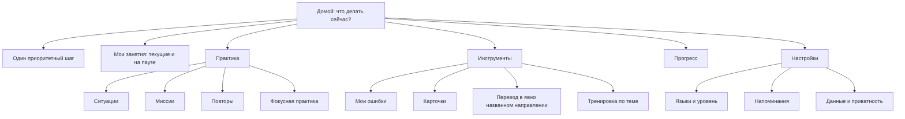

# Навигация и UX Tutorlaing

Документ фиксирует информационную архитектуру Telegram-интерфейса. Его цель —
сохранять понятный путь ученика при добавлении новых упражнений и инструментов.

## Результат аудита

До изменения главный экран показывал 6–7 равнозначных действий, иногда дважды
предлагал повторы и не давал очевидно продолжить незаконченный шаг. Настройки
смешивали языки, уровень, напоминания и приватность в одном списке. Кнопка
`Назад` могла вести и к родителю, и домой, а завершение задания происходило без
подтверждения. Это увеличивало цену выбора и риск случайной потери контекста.

Рассмотрены три модели:

1. линейный мастер — прост в первом запуске, но мешает возвращающемуся ученику;
2. постоянная reply-клавиатура — удобна для стабильных разделов, но не подходит
   для ответов на задания: в ней нет callback ID текущего item;
3. компактный dashboard — один рекомендуемый шаг и стабильные разделы.

Выбран компактный dashboard с гибридным управлением: Telegram остаётся рабочим
пространством занятия, четыре стабильных назначения доступны снизу, а действия
текущего задания остаются inline. Текстовые slash-команды дублируют только
верхнеуровневые входы и служебные операции.

## Информационная архитектура



Приоритет главного действия:

1. продолжить активный scenario/mission/drill или ввод фразы;
2. выполнить готовый интервальный повтор;
3. начать первую тему ближайшего плана;
4. выбрать жизненную ситуацию.

## Правила интерфейса

- На экране один визуально первый основной action; остальные — навигация.
- Нижняя клавиатура v5 содержит только `Сегодня`, `Мои занятия`, `Практика`,
  `Инструменты`. Она не содержит профиль, настройки и ответы на упражнения:
  первые доступны из соответствующих экранов, вторые принадлежат карточке.
- Нажатие нижней кнопки открывает новый экран внизу ленты и удаляется как
  служебное сообщение. Inline callback фокусирует workspace на message id
  фактически нажатой карточки.
- Полный динамический текст находится в сообщении. В inline-кнопке допускается
  только короткий глагол или идентификатор A/B/C/D/1–5: Telegram не гарантирует
  перенос длинной подписи и обрезает её на узком экране.
- `Домой` всегда означает dashboard. Возврат к родителю называет назначение:
  `К настройкам`, `К языкам`, `К мастерской`.
- Текст кнопки описывает результат, а не внутренний тип операции.
- Направление перевода всегда содержит название target language.
- Активное упражнение закрывается только через подтверждение; возврат из
  подтверждения не меняет state.
- Пустое, ошибочное и итоговое состояние всегда имеет безопасный выход.
- Следующий учебный шаг появляется только по `Далее` либо по одному scheduler
  slot; inline-переходы редактируют текущую карточку.
- Вкладки AI-разбора сохраняют доступ к `Домой` и не создают вертикальную ленту.
- Reply keyboard устанавливается одним коротким carrier-сообщением, которое
  остаётся в истории: удаление carrier скрывает клавиатуру в Telegram-клиенте.
  Установка version-gated и повторяется только после изменения структуры или
  языка. Сам carrier появляется перед основным экраном, поэтому не закрывает его.
  Нажатая reply-кнопка и stale-state notice удаляются автоматически.
- Перевод является stateless-инструментом и не закрывает занятие. Карточки и
  тематический drill являются обычными sessions: они не прячут другую работу,
  а после завершения предлагают явный переход в `Мои занятия`.
- Пока инструмент ждёт текст, напоминание не вклинивается в текущую карточку.
- Новая функция входит в один из стабильных разделов; новый пункт верхнего
  уровня требует отдельного usability-обоснования.
- Только foreground-занятие ждёт свободный ответ. Любое другое открытое занятие
  показывает статус и позицию в `Мои занятия` и продолжается по явному выбору.
- Неизвестная slash-команда и устаревшая inline-кнопка никогда не передаются в
  движок как ответ ученика: показывается справка либо безопасный выход.

## Три слоя управления

| Слой | Назначение | Что в нём запрещено |
|---|---|---|
| Reply keyboard | Четыре постоянных места приложения | Ответы, item ID, редкие настройки |
| Inline buttons | Действия над видимой карточкой или объектом | Глобальные дубликаты без контекста |
| Slash commands | Доступность верхних разделов и служебных функций | Скрытые legacy aliases и ответы заданию |

Канонические команды: `/start`, `/activities`, `/practice`, `/tools`,
`/progress`, `/settings`, `/help`, `/grammar`, `/privacy`, `/delete_me`. Telegram
регистрирует их с локализованными описаниями для ru/uk/en/pl. `/help@BotName`
и другие команды с bot suffix нормализуются тем же router.

## Свободная фраза

Если `stage` равен `idle` или `waiting`, обычный текст не запускает урок и не
угадывает намерение. Под сообщением появляется одна свежая карточка:

```text
ЧТО СДЕЛАТЬ С ФРАЗОЙ?
«исходный текст»

[ Перевести → Polski ]
[ Перевести → Русский ]
[ Проверить ошибки и естественность ]
[ Перефразировать: нейтрально / официально / дружелюбно ]
[ Объяснить грамматику ]
```

Фраза хранится отдельно от activity state, поэтому ожидающее задание не
теряется. Callback содержит только короткий inbox id и всегда проверяет chat
owner. Результат проверки использует знакомые вкладки `Ответ / Варианты /
Грамматика / Перевод`.

## Проверка изменений

Regression tests фиксируют порядок приоритетов, отсутствие дубликата повторов,
иерархию настроек, безопасное подтверждение выхода и наличие `Домой` в пустых
состояниях. Для ручного dogfooding проверяются три задачи без команд:

1. продолжить вчерашнее упражнение;
2. сменить язык интерфейса и вернуться к настройкам;
3. перевести фразу в нужном направлении и вернуться домой.

Основание решений: visibility of system status, user control and freedom,
consistency, recognition rather than recall и minimalist design. Telegram
callback подтверждается немедленно, а переходы внутри одного контекста
редактируют карточку вместо создания лишних сообщений.
## Mission workspace

Миссия открывается из раздела практики рядом с обычными ситуациями, но визуально
оформлен как дело: миссия, номер шага, не более трёх накопленных фактов, реплика
персонажа и одно действие ученика. Ученик всегда пишет свою реплику; готовых
вариантов ответа нет. Inline остаются смысловая подсказка, преподаватель и
безопасная остановка.

После ответа та же рабочая поверхность показывает последствие. Следующий узел
открывается только кнопкой «Далее» либо одним плановым напоминанием. Подсказка и
подтверждение остановки заменяют карточку на месте. Переводчик, карточки и другие
инструменты доступны независимо, а миссия остаётся в списке на своём node до
явного продолжения.
