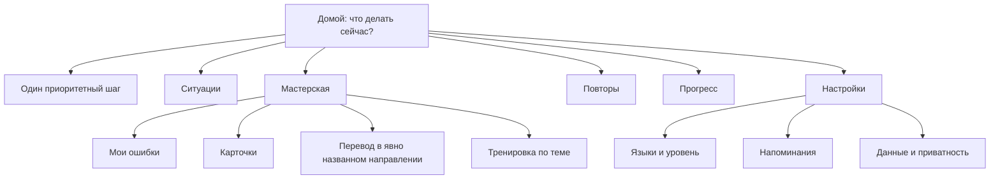

# Навигация и UX Tutorlaing

Документ фиксирует информационную архитектуру Telegram-интерфейса. Его цель —
сохранять понятный путь ученика при добавлении новых упражнений и инструментов.

## Результат аудита

До изменения главный экран показывал 6–7 равнозначных действий, иногда дважды
предлагал повторы и не давал очевидно продолжить незаконченный шаг. Настройки
смешивали языки, уровень, напоминания и приватность в одном списке. Кнопка
`Назад` могла вести и к родителю, и домой, а завершение задания происходило без
подтверждения. Это увеличивало цену выбора и риск случайной потери контекста.

Рассмотрены три модели:

1. линейный мастер — прост в первом запуске, но мешает возвращающемуся ученику;
2. постоянная reply-клавиатура — удобна для стабильных разделов, но не подходит
   для ответов на задания: в ней нет callback ID текущего item;
3. компактный dashboard — один рекомендуемый шаг и стабильные разделы.

Выбран компактный dashboard с гибридным управлением: Telegram остаётся рабочим
пространством занятия, четыре стабильных раздела доступны снизу, а действия
текущего задания остаются inline.

## Информационная архитектура

Приоритет главного действия:

1. продолжить активный scenario/review/drill/ввод фразы;
2. выполнить готовый интервальный повтор;
3. начать первую тему ближайшего плана;
4. выбрать жизненную ситуацию.

## Правила интерфейса

- На экране один визуально первый основной action; остальные — навигация.
- Нижняя клавиатура содержит только `Учиться`, `Инструменты`, `Прогресс`,
  `Настройки`. Она не содержит ответов на упражнения.
- Полный динамический текст находится в сообщении. В inline-кнопке допускается
  только короткий глагол или идентификатор A/B/C/D/1–5: Telegram не гарантирует
  перенос длинной подписи и обрезает её на узком экране.
- `Домой` всегда означает dashboard. Возврат к родителю называет назначение:
  `К настройкам`, `К языкам`, `К мастерской`.
- Текст кнопки описывает результат, а не внутренний тип операции.
- Направление перевода всегда содержит название target language.
- Активное упражнение закрывается только через подтверждение; возврат из
  подтверждения не меняет state.
- Пустое, ошибочное и итоговое состояние всегда имеет безопасный выход.
- Следующий учебный шаг появляется только по `Далее` либо по одному scheduler
  slot; inline-переходы редактируют текущую карточку.
- Вкладки AI-разбора сохраняют доступ к `Домой` и не создают вертикальную ленту.
- Служебная установка reply keyboard не остаётся в ленте; stale-state notice
  удаляется автоматически, а не превращается в постоянное сообщение.
- Мастерская является временным слоем: перевод не закрывает занятие, а
  карточки/тематический drill после завершения возвращают сохранённый шаг.
- Пока инструмент ждёт текст, напоминание не вклинивается в текущую карточку.
- Новая функция входит в один из стабильных разделов; новый пункт верхнего
  уровня требует отдельного usability-обоснования.

## Проверка изменений

Regression tests фиксируют порядок приоритетов, отсутствие дубликата повторов,
иерархию настроек, безопасное подтверждение выхода и наличие `Домой` в пустых
состояниях. Для ручного dogfooding проверяются три задачи без команд:

1. продолжить вчерашнее упражнение;
2. сменить язык интерфейса и вернуться к настройкам;
3. перевести фразу в нужном направлении и вернуться домой.

Основание решений: visibility of system status, user control and freedom,
consistency, recognition rather than recall и minimalist design. Telegram
callback подтверждается немедленно, а переходы внутри одного контекста
редактируют карточку вместо создания лишних сообщений.
## Quest workspace

Квест открывается из главного экрана рядом с обычными ситуациями, но визуально
оформлен как дело: миссия, номер шага, не более трёх накопленных фактов, реплика
персонажа и одно действие ученика. Полные длинные варианты находятся в тексте,
inline-кнопки содержат только A/B/C/D.

После ответа та же рабочая поверхность показывает последствие. Следующий узел
открывается только кнопкой «Далее» либо одним плановым напоминанием. Подсказка и
подтверждение остановки заменяют карточку на месте. Переводчик, карточки и другие
инструменты доступны независимо и возвращают пользователя в тот же quest node.
